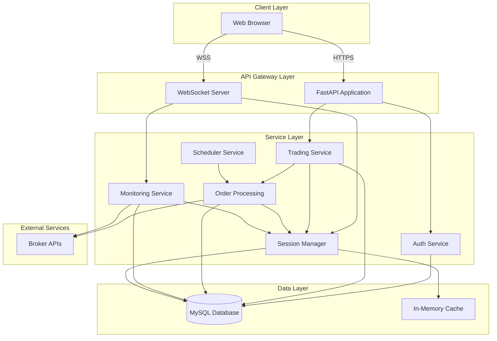

# System Architecture

## Architecture Overview

The trading system follows a **layered service-oriented architecture** with clear separation of concerns, modular components, and well-defined interfaces.

## High-Level Architecture



## Component Architecture

### 1. API Gateway Layer

#### FastAPI Application
- **Responsibility**: HTTP request routing, middleware execution, request validation
- **Components**:
  - REST API endpoints
  - Middleware (CORS, rate limiting, error handling, monitoring)
  - Request/response serialization
  - Dependency injection

#### WebSocket Server
- **Responsibility**: Real-time bidirectional communication
- **Components**:
  - Connection management
  - Message routing
  - Broadcast mechanisms
  - Monitoring loop orchestration

### 2. Service Layer

#### Authentication Service
- **Purpose**: User authentication and authorization
- **Key Operations**:
  - User login/logout
  - Session token generation
  - Token validation
  - Permission checking

**Design Choices**:
- Session-based authentication (not JWT)
- Token caching with TTL
- Database-backed session storage

**Trade-offs**:
- ✅ Better server-side control
- ✅ Easier session revocation
- ❌ Requires database access for validation
- ❌ Scaling challenges (stateless scaling not possible)

#### Trading Service
- **Purpose**: Core trading operations orchestration
- **Key Operations**:
  - Order placement
  - Order modification
  - Order cancellation
  - Position queries

**Design Choices**:
- Service coordinates between repositories and broker APIs
- Validation before broker API calls
- Transaction management for data consistency

**Trade-offs**:
- ✅ Centralized business logic
- ✅ Easier testing and maintenance
- ❌ Service becomes bottleneck
- ❌ Complex dependency management

#### Session Manager
- **Purpose**: Broker session lifecycle management
- **Key Operations**:
  - Session creation and refresh
  - Session validation
  - Token storage and retrieval
  - Multi-account session handling

**Design Choices**:
- Active session tracking per account
- Automatic session refresh
- Session pooling per user-account combination

**Trade-offs**:
- ✅ Efficient session reuse
- ✅ Reduced API calls
- ❌ Memory overhead for session storage
- ❌ Complex session state management

#### Order Processing Service
- **Purpose**: Unified order processing for all order types
- **Key Operations**:
  - Manual orders
  - Algorithmic orders
  - Scheduled orders
  - Batch orders

**Design Choices**:
- Unified interface for all order types
- Order ID generation strategy
- Daily counter management
- Broker API abstraction

**Trade-offs**:
- ✅ Consistent order handling
- ✅ Code reuse
- ❌ Complex conditional logic
- ❌ Single point of failure

#### Scheduler Service
- **Purpose**: Time-based order execution
- **Key Operations**:
  - Scheduled order placement
  - Daily schedule management
  - Time-based triggers

**Design Choices**:
- Independent scheduler process
- Database-backed schedule storage
- Timezone-aware scheduling

**Trade-offs**:
- ✅ Decoupled from main application
- ✅ Reliable scheduling
- ❌ Additional process management
- ❌ Clock synchronization requirements

#### Monitoring Service
- **Purpose**: Real-time monitoring and synchronization
- **Key Operations**:
  - Broker API polling
  - Data synchronization
  - PnL calculation
  - Order lifecycle management

**Design Choices**:
- Per-user monitoring loops
- 60-second cycle intervals
- Conditional step execution
- WebSocket-based updates

**Trade-offs**:
- ✅ Real-time updates
- ✅ User-specific monitoring
- ❌ High resource usage
- ❌ Complex error handling

### 3. Data Layer

#### Database (MySQL)
- **Purpose**: Persistent data storage
- **Key Tables**:
  - Users, accounts, sessions
  - Orders, positions
  - Strategies, settings
  - Broker data (order book, positions)

**Design Choices**:
- Relational database (MySQL)
- Foreign key constraints
- Indexes for performance
- Transaction support

**Trade-offs**:
- ✅ ACID guarantees
- ✅ Complex queries support
- ❌ Scaling challenges
- ❌ Lock contention

#### In-Memory Cache
- **Purpose**: Fast access to frequently used data
- **Cached Data**:
  - Session tokens
  - User authentication state
  - Frequently accessed settings

**Design Choices**:
- In-memory Python dictionaries
- TTL-based expiration
- Per-process cache (not distributed)

**Trade-offs**:
- ✅ Fast access
- ✅ Simple implementation
- ❌ Not shared across processes
- ❌ Lost on restart

### 4. External Integration Layer

#### Broker APIs
- **Purpose**: Broker integration for order execution
- **Operations**:
  - Order placement
  - Order modification/cancellation
  - Position queries
  - Order book queries

**Design Choices**:
- REST API integration
- Session-based authentication
- Retry logic for transient failures
- Error handling and mapping

**Trade-offs**:
- ✅ Direct integration
- ✅ Real-time data
- ❌ External dependency
- ❌ Rate limiting constraints

## Data Flow Architecture

### Order Placement Flow

```
User Request
    ↓
FastAPI Endpoint
    ↓
Authentication Middleware (validate token)
    ↓
Trading Service
    ↓
Order Processing Service
    ↓
Session Manager (get/refresh session)
    ↓
Broker API (place order)
    ↓
Database (save order)
    ↓
WebSocket (notify user)
    ↓
Response to User
```

### Monitoring Loop Flow

```
WebSocket Connection
    ↓
Monitoring Service (per user)
    ↓
[Every 60 seconds]
    ↓
Step 1: Fetch Broker Data (concurrent API calls)
    ↓
Step 2: Calculate PnL (FIFO matching)
    ↓
Step 3: Update Orders (SQL update)
    ↓
Step 4: Place SL/TP Orders (if needed)
    ↓
Step 5-6: Modify Orders (based on fair prices)
    ↓
Step 7: Delete Rejected Orders
    ↓
Step 8: Entry Regenerate (if permitted)
    ↓
Step 9: Place Rejected Orders
    ↓
WebSocket Update (if errors occurred)
```

## Design Patterns

### 1. Repository Pattern

**Purpose**: Abstract data access layer

**Implementation**:
- Repository classes for each entity (UserRepo, OrderRepo, etc.)
- Database queries encapsulated in repositories
- Service layer uses repositories, not direct database access

**Benefits**:
- Easy testing (mock repositories)
- Database-agnostic business logic
- Centralized query logic

### 2. Service Pattern

**Purpose**: Business logic encapsulation

**Implementation**:
- Service classes for each domain (TradingService, AuthService, etc.)
- Services coordinate between repositories and external APIs
- Stateless service instances

**Benefits**:
- Clear business logic organization
- Reusable service methods
- Easier maintenance

### 3. Manager Pattern

**Purpose**: Resource and connection management

**Implementation**:
- WebSocketManager, SessionManager
- Singleton or shared instances
- Lifecycle management

**Benefits**:
- Centralized resource management
- Connection pooling
- Efficient resource utilization

### 4. Middleware Pattern

**Purpose**: Cross-cutting concerns

**Implementation**:
- Authentication middleware
- Rate limiting middleware
- Error handling middleware
- Monitoring middleware

**Benefits**:
- Separation of concerns
- Reusable middleware
- Clean request/response pipeline

### 5. Observer Pattern (WebSocket)

**Purpose**: Real-time event distribution

**Implementation**:
- WebSocket connections as observers
- Monitoring service as subject
- Broadcast updates to connected clients

**Benefits**:
- Decoupled notification system
- Multiple subscribers
- Real-time updates

## Deployment Architecture

### Single-Instance Deployment

```
┌─────────────────────────────────────┐
│         Application Server          │
│  ┌───────────────────────────────┐  │
│  │   FastAPI Application         │  │
│  │   - REST API                  │  │
│  │   - WebSocket Server          │  │
│  │   - Services                  │  │
│  └───────────────────────────────┘  │
│  ┌───────────────────────────────┐  │
│  │   Independent Processes       │  │
│  │   - Monitoring Service        │  │
│  │   - Scheduler Service         │  │
│  └───────────────────────────────┘  │
└─────────────────────────────────────┘
                │
                │
┌───────────────▼───────────────┐
│      MySQL Database           │
└───────────────────────────────┘
```

### Scaling Considerations

**Current Limitations**:
- Single application instance
- In-memory caching (not shared)
- Database single instance
- WebSocket connections per process

**Scaling Strategies** (see [Scaling Strategies](09-scaling-strategies.md)):
- Horizontal scaling with load balancer
- Distributed caching (Redis)
- Database read replicas
- WebSocket connection distribution

## Security Architecture

### Authentication Flow

```
1. User Login
   ↓
2. Credentials Validation
   ↓
3. Session Token Generation
   ↓
4. Token Storage (Database + Cache)
   ↓
5. Token Returned to Client
   ↓
6. Token in Subsequent Requests
   ↓
7. Middleware Validation
   ↓
8. Request Processing
```

### Security Layers

1. **Transport Security**: HTTPS/WSS encryption
2. **Authentication**: Session tokens
3. **Authorization**: Permission checks per operation
4. **Rate Limiting**: Prevent abuse
5. **Input Validation**: Request validation
6. **SQL Injection Prevention**: Parameterized queries
7. **Credential Storage**: Encrypted in database

## Error Handling Architecture

### Error Handling Layers

1. **Application Level**: Try-catch blocks, error logging
2. **Middleware Level**: Global error handler
3. **Service Level**: Service-specific error handling
4. **Database Level**: Transaction rollback
5. **External API Level**: Retry logic, error mapping

### Error Flow

```
Error Occurs
    ↓
Error Caught (try-catch)
    ↓
Error Logged
    ↓
Error Classification
    ↓
Error Response/Recovery
    ↓
User Notification (if applicable)
```

## Performance Considerations

### Bottlenecks

1. **Database Queries**: Complex PnL calculation queries
2. **Broker API Calls**: Rate limits and latency
3. **WebSocket Connections**: Connection management overhead
4. **Monitoring Loops**: Per-user loops consuming resources

### Optimization Strategies

1. **Database**: Indexes, query optimization, connection pooling
2. **API Calls**: Concurrent execution, caching, batching
3. **WebSocket**: Connection pooling, efficient broadcasting
4. **Monitoring**: Efficient loops, conditional execution

---

**Next**: [Database Design](03-database-design.md)

